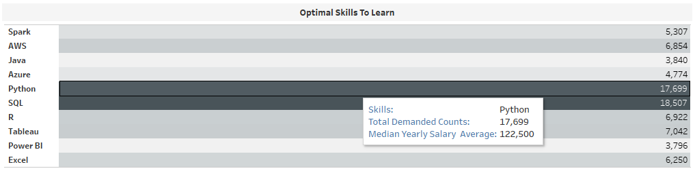
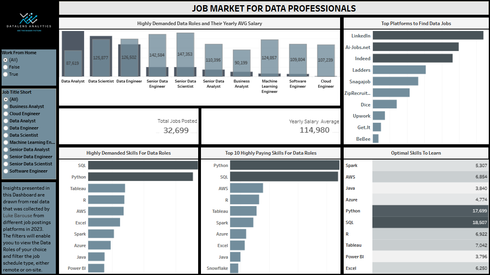

# Job Market for Data Professionals (2023)

This project analyzes real-world job posting data to provide insights into the current data professional job 
market. The data, originally collected by Luke Barousse in 2023 from various job posting platforms, was processed, 
analyzed, and visualized to answer key questions relevant to aspiring and current data professionals.

## Project Overview

This project aimed to understand the demand and compensation landscape for various data roles. By analyzing job postings, 
I sought to identify in-demand roles, high-paying skills, and optimal learning paths for those entering or advancing in the data field.

## Key Questions Addressed

This analysis focuses on answering the following key questions:

1.  **What are the highly demanded data roles and their Yearly Average Salary?**
2.  **What are the top paying skills for data roles?**
3.  **What are the top highly demanded skills for data roles?**
4.  **What are the optimal Skills to learn?**
5.  **Where to find Data Related Jobs?**

## Data Source

The dataset used in this project was compiled by Luke Barousse in 2023. It consists of data scraped from various online job posting platforms. 
The data was provided directly by Luke Brousse and now is available on his website, datanerd.tech.

## Technologies Used

*   **PostgreSQL:** Used for database creation and data management.
*   **SQL:** Used for data cleaning, transformation, and analysis within the PostgreSQL database (pgAdmin 4).
*   **Tableau:** Used for data visualization and creating interactive dashboards.
*   **VS Code:** Used for creating, testing and managing queries.

## The Analysis
### 1. Highly Demanded Roles and Their Yearly Average Salary
### 2. Top Paying Skills for Data Roles
### 3. Top Highly Demanded Skills for Data Roles
### 4. Optimal Skills to Learn

### 5. Job Platforms for Data Roles

## Tableau Dashboard

## What I Learned

## Conclusion