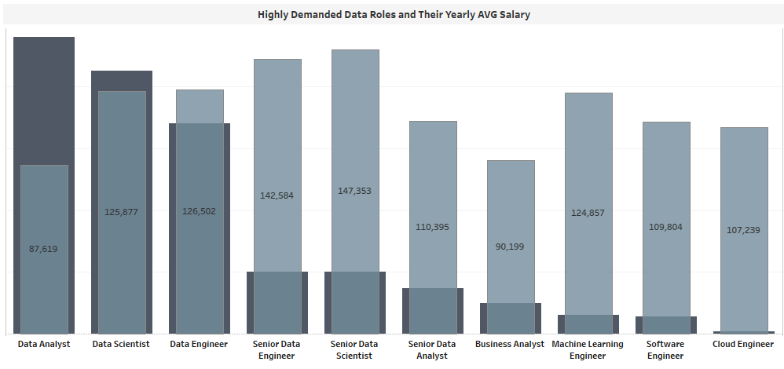
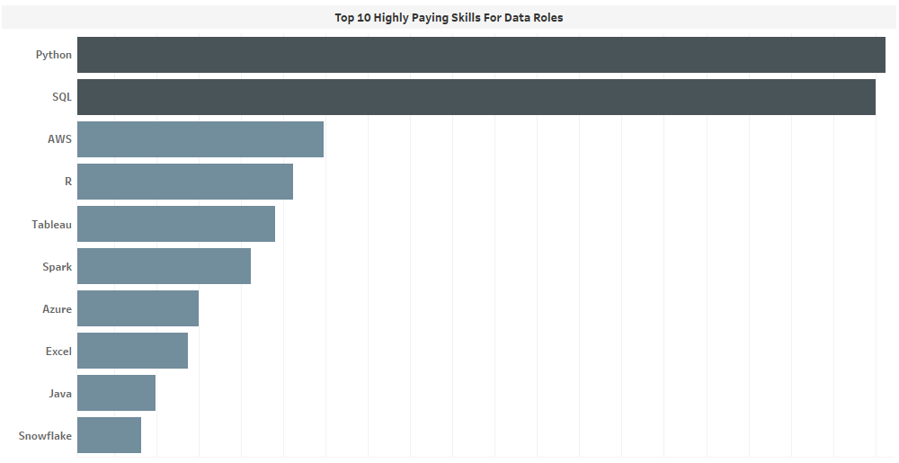
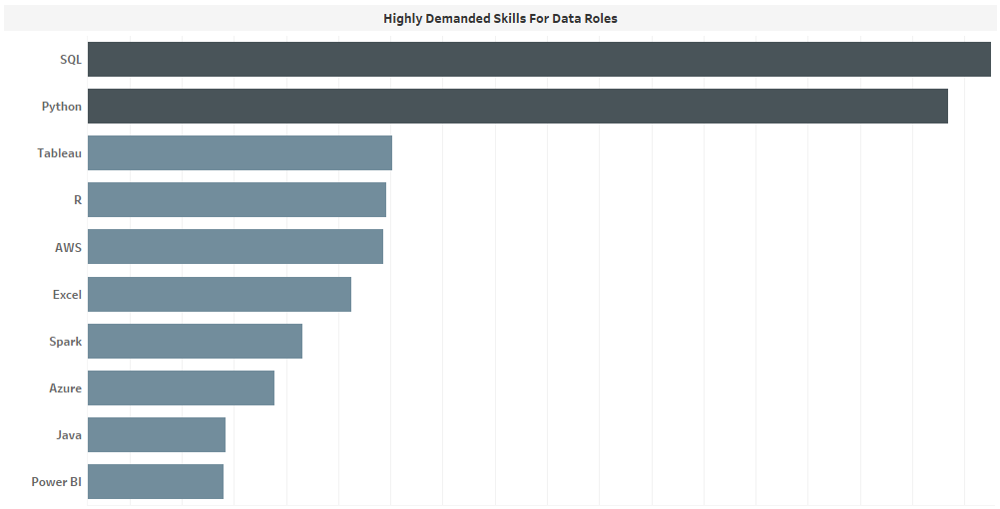
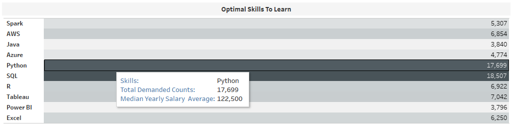
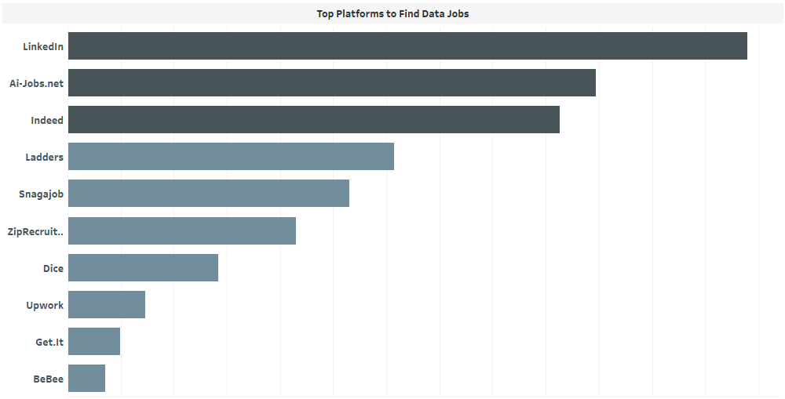

# Job Market for Data Professionals (2023)

This project analyzes real-world job posting data to provide insights into the current data professional job 
market. The data, originally collected by Luke Barousse in 2023 from various job posting platforms, was processed, 
analyzed, and visualized to answer key questions relevant to aspiring and current data professionals.

## Project Overview

This project aimed to understand the demand and compensation landscape for various data roles. By analyzing job postings, 
I sought to identify in-demand roles, high-paying skills, and optimal learning paths for those entering or advancing in the data field.

## Key Questions Addressed

This analysis focuses on answering the following key questions:

1.  **What are the highly demanded data roles and their Yearly Average Salary?**
2.  **What are the top paying skills for data roles?**
3.  **What are the top highly demanded skills for data roles?**
4.  **What are the optimal Skills to learn?**
5.  **Where to find Data Related Jobs?**

## Data Source

The dataset used in this project was compiled by Luke Barousse in 2023. It consists of data scraped from various online job posting platforms. 
The data was provided directly by Luke Brousse and now is available on his website, datanerd.tech.

## Technologies Used

*   **PostgreSQL:** Used for database creation and data management.
*   **SQL:** Used for data cleaning, transformation, and analysis within the PostgreSQL database (pgAdmin 4).
*   **Tableau:** Used for data visualization and creating interactive dashboards.
*   **VS Code:** Used for creating, testing and managing queries.
## Data Cleaning
### Cleaning The Same Platforms written Differently and Removing the PREFIX 'Via' from all Platforms.
I selected unique platforms and discovered that 'LinkedIn' was written in different forms. So, I solved it by using CASE function as shown in the Query below.
```sql
CASE
			WHEN job_via LIKE ('%Linked%') THEN 'LinkedIn'
			WHEN job_via NOT LIKE ('%Linked%') THEN TRIM(RIGHT(job_via,-3))
	END AS Platform,
```
### Calculating Yearly Average from Provided Hourly rate to remove NULLS.
Some job postings had only Hourly payment rate with no Yearly Salary Average. To solve this, I took the provided hourly rate and multiplied it with total working hours in a year which is 2080. 
```sql
CASE
		WHEN salary_hour_avg IS NULL THEN ROUND(salary_year_avg)
		WHEN salary_year_avg IS NULL THEN ROUND(salary_hour_avg * 2080)
		WHEN salary_year_avg IS NULL AND salary_hour_avg IS NULL THEN NULL
	END AS salary_year_average,
```
### Joins
To be able to thoroughly analyze and relate data roles with respective skills from separated table, I used SQL joins. 
```sql
INNER JOIN skills_job_dim ON job_postings_fact.job_id = skills_job_dim.job_id
INNER JOIN skills_dim ON skills_job_dim.skill_id = skills_dim.skill_id
```
## The Analysis
### 1. Highly Demanded Roles and Their Yearly Average Salary
The insights show that Data Analysts are leading as highly demanded Data Professionals while Senior Data Scientists lead as Highly Paid Data Professionals. Cloud Engineering rank the least in terms of demand but has fair yearly salary average.

*Figure 1: A Graph Showing the Demand and Average Salary for each Data Role.*

### 2. Top Paying Skills for Data Roles
Python and SQL rank as the most paying skills for Data Professionals. To be able to see the rank of skills for specific role; [Click here to access Interactive Dashboard with filters on Tableu](https://public.tableau.com/shared/6KB63S326?:display_count=n&:origin=viz_share_link)

*Fifure 2: A Graph Showing High Paying Skills for Data Professionals*

### 3. Top Highly Demanded Skills for Data Roles
SQL and Python also are leading as the top demanded skills on Job Market for data Professionals. [Click here to access Interactive Dashboard with filters on Tableu](https://public.tableau.com/shared/6KB63S326?:display_count=n&:origin=viz_share_link)

*Figure 3: A Graph Showing Highly Demanded Skills for Data Roles.*

### 4. Optimal Skills to Learn
These are the optimal skills to learn for aspiring data professionals. the skills are ordered based on their Annual Salary median and the highlighted skills are those that both found high paying and most demanded on job market. 

*Figure 4: A Table Showing Top 10 High Paying and Demanded Skills on Data Job Market.*

### 5. Job Platforms for Data Roles
Linked is ranked as the top platform that post many jobs for Data Professionals. The down below query shows how I got these insights.
```sql
SELECT 
		CASE
			WHEN job_via LIKE ('%Linked%') THEN 'LinkedIn'
			WHEN job_via NOT LIKE ('%Linked%') THEN TRIM(RIGHT(job_via,-3))
		END AS Platforms,
    COUNT (*) AS counts
FROM job_postings_fact
WHERE 
    job_title_short = 'Data Analyst' 
    AND job_work_from_home = TRUE
GROUP BY 
    job_via
ORDER BY counts DESC
LIMIT 10;
```

*Figure 5: Top Platforms to find Jobs For Data Professionals.*

## Tableau Dashboard
This is the interactice Dasboard created from the insights driven from analysis of 2023 Job Postings for Data Professionals. You can access the live version by clicking [Here.](https://public.tableau.com/shared/6KB63S326?:display_count=n&:origin=viz_share_link)

*Figure 6: Interactive Tableau Dashboard showcasing various data insights.*

[Click here to access Interactive Dashboard on Tableu](https://public.tableau.com/shared/6KB63S326?:display_count=n&:origin=viz_share_link)

## What I Learned

## Conclusion